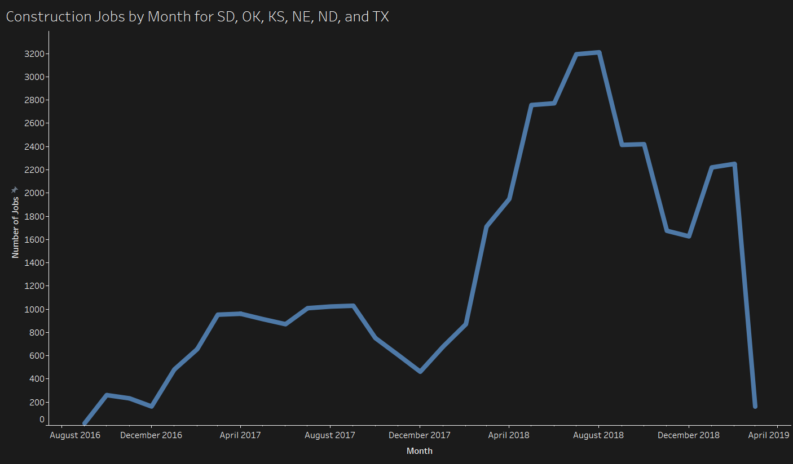
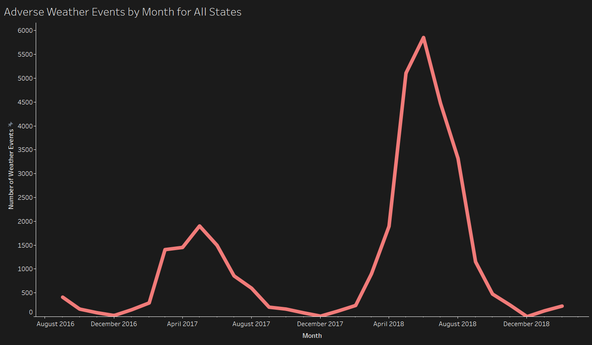
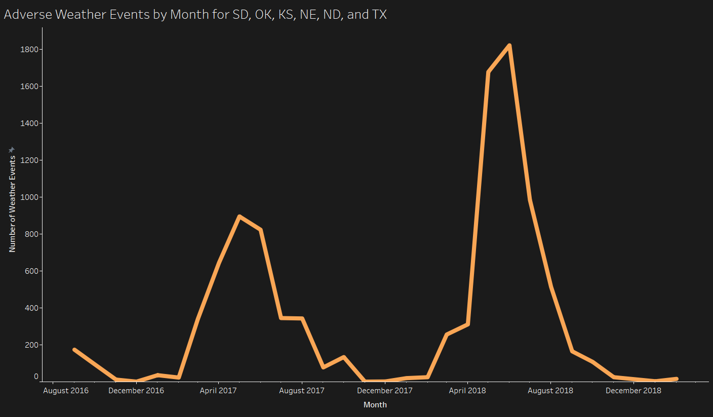
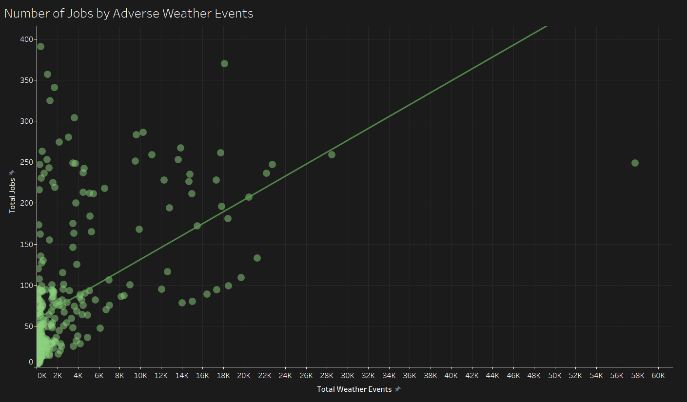
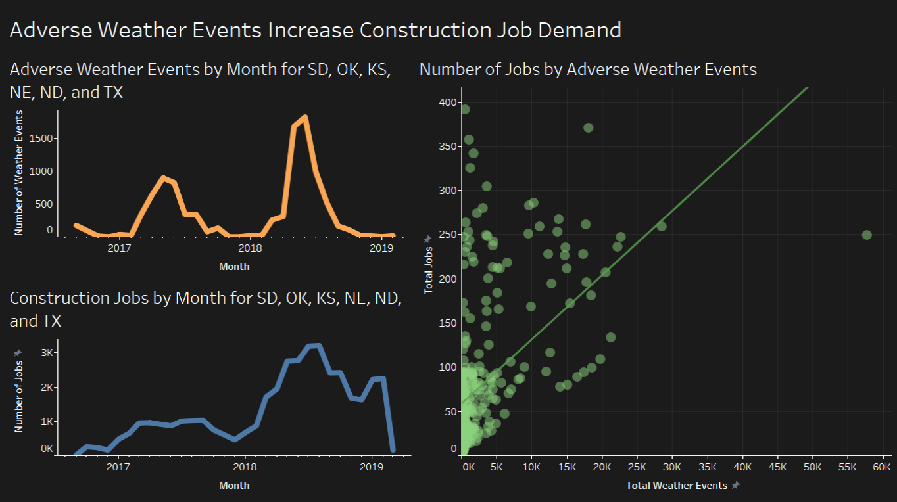

# **Hover: Construction Job Demand**

**Table of Contents**

-   [Introduction](#introduction)
-   [Task 1: Explore the Jobs Data](#explore-the-jobs-data)
-   [Task 2: Explore the Weather Data](#explore-the-weather-data)
-   [Task 3: Weather's Affect on Job Demand](#affect-of-weather-on-job-demand)
-   [Task 4: Dashboard of Results](#dashboard-of-results)

# Introduction

In this assignment, you’ll analyze data regarding construction
jobs and the role weather might play in driving future demand. Companies in this space need to be able to assess what future demand will look like in order to allocate resources and teams accordingly. Sending a small team to a location may mean potential customers will go with a competitor because they can getthe job done in a shorter time frame due to your limited resources.

The data needed for this assignment (hover.*) comes from two different sources.

The first data source (jobs) consists of historical data from a software solution provider for construction companies:

- **job_identifier** - The unique ID for a job
- **organization_id** - ID for the accountthat purchased the job
- **job_location_city** - The city where the job was located
- **job_location_region_code** - The state where the job was located
- **job_first_upload_complete_datetime** - The date on which the customer uploaded photos for the job.
- **job_deliverable** - The type of job that the customer requested. Either complete (full building) or roof.

The second dataset(weather) comes from the NOAA Storm Prediction Center and catalogs adverse weather events across the United States:

- **comments** - A description of the weather event
- **county** - The county of the weather event
- **state** - The state of the weather event
- **location** - The address of the weather event
- **longitude** - The longitude of the weather event
- **latitude** - The latitude of the weather event
- **datetime** - The datetime of the weather event
- **composite_key** - Unique key for the weather event, combining the timestamp, longitude, and latitude of the event


------------------------------------------------------------------------

# Explore the Jobs Data

- Write a query that returns the total number of jobs at the monthly level for each year.

``` SQL
SELECT
  DATE_TRUNC('month', job_first_upload_complete_datetime) AS month,
  COUNT(*) AS number_of_jobs
FROM 
  hover.jobs
GROUP BY 
  month
ORDER BY 
  month
```
- Visualize the result table. Is there any seasonality to the job requests? Is there a season that has more requests than others?



There is seasonality to the construction job requests. Winter has the least number of job requests while early Spring and late Summer months like May, June, July, and August have the highest number of job requests.

- We didn’t look at data aggregated by month (without the year) because the first month of the data is September 2016 and the last month of data is March 2019, so every month wouldn’t have
appeared an equal number of times in a GROUP BY. Can you write a query that counts how many times each month has appeared in the data?
``` SQL
SELECT
  DATE_PART('month', job_first_upload_complete_datetime) AS month,
  COUNT(DISTINCT date_trunc('month', job_first_upload_complete_datetime)) AS count_of_month
FROM 
  hover.jobs
GROUP BY 
  month
ORDER BY 
  month
```


------------------------------------------------------------------------

# Explore the Weather Data

- The entire weather dataset consists of “adverse weather events”, e.g. tornados, fallen trees, sustained high gusts of wind, etc. Write a query that counts the number of adverse weather events for each month and year of the data.

``` SQL
SELECT
  DATE_TRUNC('month', datetime) AS month,
  COUNT(*) as number_of_events
FROM
  hover.weather
GROUP BY
  month
ORDER BY
  month
```
- Modify your query to filter out any information prior to September 2016 (the start of the job request data). Visualize the data.

``` SQL
SELECT
  DATE_TRUNC('month', datetime) AS month,
  COUNT(*) as number_of_events
FROM
  hover.weather
WHERE
  datetime >= '2016-09-01'
GROUP BY
  month
ORDER BY
  month
```


- The weather data includes values for all 50 states. Modify your query once more so that it only shows information from the states that are seen in the jobs data. Visualize the filtered data and compare the filtered data to the original data.

Method 1: Using a Subquery to Filter
``` SQL
SELECT
  DATE_TRUNC('month', datetime) AS month,
  COUNT(*) AS number_of_events
FROM
  hover.weather
WHERE
  datetime >= '2016-09-01'
  and state IN (
    SELECT
      DISTINCT job_location_region_code
    FROM
      hover.jobs
  )
GROUP BY
  month
ORDER BY
  month
```

Method 2: Using a Subquery to Join
``` SQL
SELECT
  DATE_TRUNC('month', w.datetime) AS month,
  COUNT(*) AS number_of_events
FROM
  hover.weather AS w
  JOIN (
    SELECT
      DISTINCT job_location_region_code
    FROM
      hover.jobs
  ) AS j ON w.state = j.job_location_region_code
WHERE
  w.datetime >= '2016-09-01'
GROUP BY
  month
ORDER BY
  month
```



- Write a few-sentence summary describing the relationship between the job requests and weather events.

Job requests and weather events have a positive relationship; as weather events increase, construction job requests increase. Adverse weather events also seem to be more common during the summer, which is why job requests are more common during the summer. These observations all make sense; adverse weather events such as hurricanes, tornados, and extreme storms are more common in the summer. Adverse weather events commonly cause damage to buildings, which is causing a spike in construction job requests during the summer months. 

------------------------------------------------------------------------

# Affect of Weather on Job Demand

- A colleague of yours already wrote a query that returns the total number of weather events grouped at the weekly level for each state in the weather data. Write a query that performs a join on the jobs table and the weekly_weather_events table your colleague created. From the jobs table, select job_deliverable, job_location_region_code, and the week of job_first_upload_complete_datetime. From the weekly_weather_events table, select n_weather_events.
  
``` SQL
SELECT
  j.job_deliverable,
  j.job_location_region_code,
  DATE_TRUNC('week', j.job_first_upload_complete_datetime) AS job_week,
  w.n_weather_events
FROM
  hover.jobs as j
  INNER JOIN hover.weekly_weather_events as w 
  ON w.state = j.job_location_region_code
  AND DATE_TRUNC('week', j.job_first_upload_complete_datetime) = w.weather_ts
```

- Use your previous query as a subquery in a new query that counts the total number of jobs and the total number of weather events for each state and week. Order your output alphabetically by state.
  
``` SQL
SELECT
  job_location_region_code,
  job_week,
  COUNT(job_week) AS total_jobs,
  SUM(n_weather_events) AS total_weather_events
FROM
  (
    SELECT
      j.job_deliverable,
      j.job_location_region_code,
      DATE_TRUNC('week', j.job_first_upload_complete_datetime) AS job_week,
      w.n_weather_events
    FROM
      hover.jobs as j
      INNER JOIN hover.weekly_weather_events as w ON w.state = j.job_location_region_code
      AND DATE_TRUNC('week', j.job_first_upload_complete_datetime) = w.weather_ts
  ) AS s
GROUP BY
  job_location_region_code,
  job_week
ORDER BY
  job_location_region_code
```
- Create a scatterplot of the total number of weather events and the total number of job requests. Be sure to show the trendline. Is there a relationship between adverse weather events and job requests?



Yes, this scatterplot shows that there is a positive linear relationship between adverse weather events and construction job requests. The more adverse weather events occur, the more construction job requests come in.


------------------------------------------------------------------------

# Dashboard of Results

[Click Here to View the Deliverable in Tableau Public](https://public.tableau.com/views/LexiPughConstructionJobDemand/ConstructionJobDemand?:language=en-US&:display_count=n&:origin=viz_share_link)


